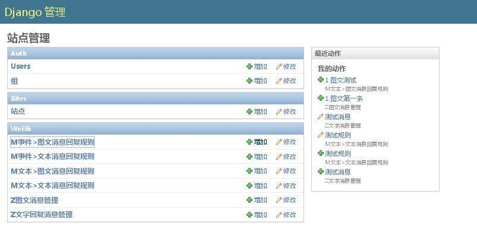
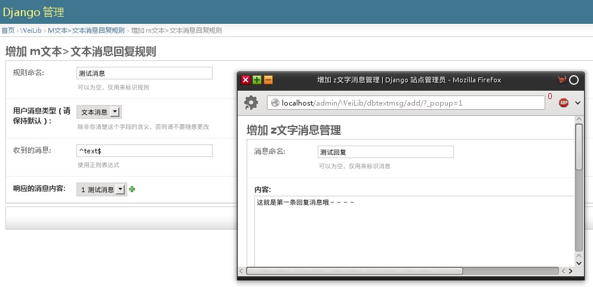
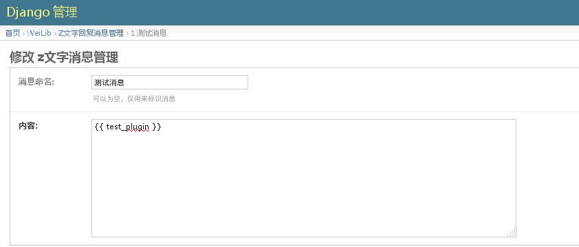

#weixin2py--微信公众平台web服务器

### 1.Summary

* 使用python2.7和django 1.5.1开发的微信公众平台服务端程序，可以自动回复用户发来微信的消息。
* 最初的启发来自“武大助手”，类似的平台，提供消息智能回复功能。
* 完全重构了代码，虽然还有很多缺陷但已经完美了很多：）欢迎提出pull request。

### 2. Feature
* 可拔插设计，提供django app ‘WeiLib’，里面有大部分可能用到的工具类和工具函数，需要的时候，新建你的django app，并且在app中使用WeiLib。
* 消息模版,WeiLil.llib中包含了text_response和pic_text_response函数，传入参数可以在任意view或者handler中使用.
* 缓存session功能，为增加诸如“谁是卧底”类的应用提供基础，更改你的缓存后端或者更改缓存接口即可.
* 路由功能((数据库路由和文件路由)，使用正则表达式对回复进行匹配。
* 支持可视化的自定义消息回复规则和程序性的消息回复规则，使用接口编写即可，通过简单的过程，你也可以集成你的聊天机器人：）
* 插件支持，你可以用django模板语法定义动态消息回复
* 当用户发来第一条消息的时候，自动检测用户是否存在并生成一个唯一的用户（使用openid），存储到数据库。(未实现)

需要老版（代码很丑陋）请移步：[这里](https://github.com/winkidney/weixin2py/tree/release1.0) 

### 3.How To
####INSTALL
依赖于django1.5和python2.7，请先安装对应版本的django和python，不支持3.x。你可以使用如下方式安装python依赖：
```bash
apt-get install python-pip
pip install django>=1.5
```
yum系系统类似方法安装依赖即可～～    
接下来,打开你的bash，切换到应用根目录,执行
```bash
python rebuild.py
```
然后在你的settings.py中编辑TOKEN，改为你自己的TOKEN    
将会自动生成数据库并添加超级用户，用户名admin,密码admin，你可以自行去这个脚本修改默认设定，数据库为了方便起见使用了sqlite    
```bash
sh runserver.sh
```
运行测试服务器（默认工作在80端口）。    
也可以使用nginx+*cgi,任何你喜欢的方式。提供了脚本ctrl8020.sh来控制fcig模式的启动和关闭。    

####Basic Usage
访问http://youhost/admin/    
登录，添加消息回复规则即可。    
例如 想对用户发来的文本消息进行匹配，并回复一条文本消息，在管理面板中选择“文本>文本消息回复规则”，根据各个字段的提示进行填写即可。
如下示例图    
用户发来的消息类型 2 回复的消息类型    
#####示例：文本2文本 消息回复规则    




#####示例：添加使用插件的   文本2文本  消息回复规则



插件消息使用django模板语法进行编写，参见[django模板语法](http://django-14-tkliuxing.readthedocs.org/en/latest/topics/templates.html)    
插件编写参见[插件编写](插件编写)

###流程说明


###APIS

####[插件](id:插件编写)
插件目前仅工作在文本回复阶段，在匹配到消息回复之后，会对回复消息进行以此渲染，渲染所用的信息字典就是插件返回的字典。
每一个插件所返回的字典内容都会被自动合并到一个字典，然后在你的消息回复定义中使用你所返回的字典中的变量即可（当然可以是动态）
#####目录结构
插件目录位于WeiLib/plugins/    
目录结构如下
```bash
WeiLib/plugins/    
    |- setting.py - 插件配置文件    
    |- activity.py - 插件实现 （名字可以任意）    
```
#####编写
1.在插件目录下新建一个任意名字的py文件，然后根据如下格式写一个名为processor函数，这个函数会接收用户的消息对象作为参数，你可以根据用户的消息动态定义消息回复。
```python
#!/usr/bin/env python
#coding:utf-8
#WeiLib/plugin/acitvity.py - activity plugin for WeiLib

def processor(recv_msg):
    """A processor must return a dict.
       If not ,program will throw the returned result.
    """
    return {'test_plugin': 'only_the test plugin output'}
```              
2.启用插件
打开setting.py，将你的插件导入并编辑plugin_text元组。
```python
import activity
plugin_text = ( activity,
             )
```
3.在消息回复中使用插件定义的内容


####handler
handler是拓展这个应用功能的另一种方式，最初开发使用的是这种方式，在没有数据库的情况下也可以正常运作，缺点是数据一旦写死修改很麻烦，适合用来生成动态内容，例如聊天机器人接口，查询接口之类的.
#####结构
目前应用内置了两个router，file_router和db_router，执行的优先级是file_router->db_router，handler是file_router才有的结构。    
#####编写一个handler
在任意应用目录新建一个handlers.py（只是约定，可以自定义名称），将handler书写到其中。一个典型的handler如下。    
```python
#!/usr/bin/env python
#coding:utf-8
#WeiLib/handlers.py - router handlers for WeiLib
#ver 0.1 by winkidney 2014.05.10

from WeiLib.lib import text_response

def default_handler(recv_msg):
    #do something
    return text_response(recv_msg, "没有匹配操作，返回默认信息")
   
```
handler 返回一个text_response或者一个pic_text_response(图文消息回复)，也可以是你自定义的response，要求必须是一个django的HttpResponse实例。    
#####启用handler
为了启用handler，你需要增加一个匹配模式，打开应用目录下的tuwei/router.py文件,示例内容如下
```python
#!/usr/bin/env python
#coding:utf-8
#tuwei/router.py - message router to generate response message
#ver 0.1 by winkidney 2014.05.10

import re

from tuwei.handlers import (help_handler,about_handler,
                            test_handler)


"""
参考信息：
消息类型：text ,event,image, video, link , location,
"""
router_patterns =[
         # 消息类型  消息文字（非文字类型消息留空）  操作函数
         #('text', re.compile('^help$'), help_handler),
         #('text', re.compile('^about$'), about_handler),
         #('text', re.compile('^test$'), test_handler),
         ]
```
将你的handler导入。然后如注释一样添加模式。    

#####在view中使用handler和router
示例文件：tuwei/views.py - 仅展现关键逻辑，详情参考具体文件
'''python
from WeiLib.router import base_router,db_router
from tuwei.router import router_patterns
from WeiLib.handlers import default_handler

try:
    from weixin2py.localsettings import TOKEN
except:
    from weixin2py.settings import TOKEN
#router 必须是一个list实例
routers = [base_router, db_router]

       
@csrf_exempt  
def home(request):
    if request.method == 'GET':
        myresponse = HttpResponse()
        if check_signature(request, TOKEN):
            myresponse.write(request.GET.get('echostr'))
            return myresponse
        else:
            myresponse.write('不提供直接访问！')
            return myresponse
        
    if request.method == 'POST':
        #check_signature(request, TOKEN)
        recv_msg = GetMsg(request.body)
        for router in routers:
            result = router(recv_msg, router_patterns)    #使用预定义的router和pattern
            if isinstance(result, HttpResponse):
                return result
        return default_handler(recv_msg)  #在view中直接使用handler
```

####Session
```python
class WeiSession(object):
    '''微信助手会话类，用来存储用户的会话状态'''
    def __init__(self, openid): #使用openid获得session，如果已存在则获得现有session，如果没有则生成的新session,缓存键的名称是openid
    
    def set_key(self, key , value): #设定一个键值，类似python字典操作，将会自动保存到会话当中
    
    def get_key(self, key): #取得key，如果不存在则返回空
```
具体的使用请自由发挥
####其他接口/工具类
WeiLib/lib.py - class:GetMsg - 从用户发送的消息从获得一个消息实例，自动识别类型并生成相应属性    
WeiLib/lib.py - function:check_signature(request, TOKEN) - 从一个request对象和指定token中验证消息是否合法，合法返回True，不合法返回False    
WeiLib/lib.py - function:get_token(appid, secretkey) - 返回一个access_token，用于腾讯的其他接口的必要验证    

### 4.Change Log
* 2014-06-10 - 修复小bug，更新文档。    
* 2014.05.09 - 2014.05.15 增加路由功能，插件功能。
* 2014.05.08 - 全面重构中
* 2013.xx.xx - first release,多么幼稚的代码

### 5.To Do List
1. 简化程序，并将通用处理过程提取出来，让处理函数可以直接方便的处理消息(done)
2. 将用户session改到key-value数据库存储或者内存缓存，提高效率和可靠性。(todo)
3. 修改数据库设定，让数据库具有通用性并允许拓展。(done)
4. 设计一套管理ui(todo)


 [博客](http://blog.gg-workshop.com/) 

 [My-github](http://github.com/winkidney)

by winkidney 2014-05-15


